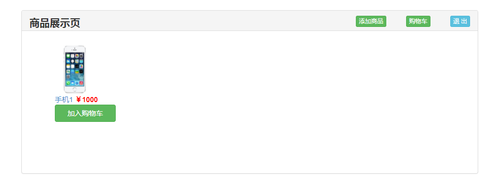

我们使用 jQuery + Semantic-UI 实现前端页面的设计，最终效果图如下:

**注册页**

**登录页**

**未登录时的主页（或用户页）**

**登录后的主页（或用户页）**

**添加商品页**

**购物车页**

上一节：[4.4 功能设计](https://github.com/nswbmw/N-blog/blob/master/book/4.4%20%E5%8A%9F%E8%83%BD%E8%AE%BE%E8%AE%A1.md)

下一节：[4.6 连接数据库](https://github.com/nswbmw/N-blog/blob/master/book/4.6%20%E8%BF%9E%E6%8E%A5%E6%95%B0%E6%8D%AE%E5%BA%93.md)
