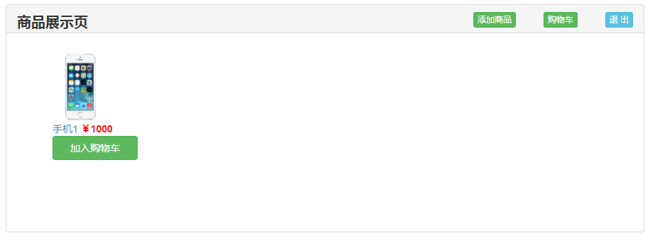

## 4.8.1 登出

现在我们来完成登出的功能。修改 routes/signout.js 如下：

**routes/logout.js**

```
module.exports = function ( app ) {
    //退出登录
    app.get('/logout', function(req, res){
        req.session.user = null;
        req.session.error = null;
        res.redirect('/home');
    });
}
```

此时点击右上角的 `退 出`，成功后如下图所示：


## 4.8.2 登录页

现在我们来完成登录页。修改 routes/signin.js 相应代码如下：

**routes/login.js**

```
//登录页面
app.get('/login',function(req,res){
    res.render('login');
});
```

新建 views/login.html，添加如下代码：

**views/login.html**

```
<!DOCTYPE html>
<html>
  <head>
    <title>用户登录</title>
	<meta charset="utf-8">
    <link href="/stylesheets/bootstrap.min.css" rel="stylesheet" media="screen">
      <script src="/javascripts/jquery-2.1.1.min.js" type="text/javascript"></script>
      <script src="/javascripts/bootstrap.min.js" type="text/javascript"></script>
		<style type="text/css">
			.panel-body{
				padding: 30px 50px 0 50px;

			}
			.form-group{
				margin-bottom: 35px;
			}
			.panel-title{
				font-size: 24px;
				font-weight: bold;
			}
		</style>
        <script type="text/javascript">
           function login(){
               var username = $('#username').val(),password = $('#password').val();
               var data = { "uname": username, "upwd":password};
               $.ajax({
                   url:'/login',
                   type:'POST',
                   data:data,
                   success:function(data,status){
                       if(status == 'success'){
                           location.href='home';
                       }
                   },
                   error:function(data,status){
                     if(status == "error"){
                         location.href='login'
                     }
                   }
               });
           }
        </script>
  </head>
<body>
<div class="container web-body" style="margin-top:100px;width: 900px;">
    <%- message %>
    <div class="row">
        <div class="col-lg-6 col-lg-offset-3">
            <div class="panel panel-default">
                <div class="panel-heading" style="height: 50px;">
                    <div class="panel-title" style="text-align: left">用户登录</div>
                </div>
                <div class="panel-body">
                    <form action="#" class="form-horizontal" role="form" method="post" >
                        <div class="form-group">
                            <input id="username" value="admin" type="text" class="form-control" name="username" placeholder="用户名" />
                        </div>
                        <div class="form-group">
                            <input id="password" value="1" type="password" class="form-control" name="password" autocomplete="off" placeholder="密码" />
                        </div>
                        <div class="form-group">
                            <input type="button" class="btn btn-success btn-block" onclick="login();" value="登 陆" />
                            <a href="register" class="btn btn-primary" style="float: right;margin-top: 20px;">注 册</a>
                        </div>
                    </form>
                </div>
            </div>
        </div>
    </div>
</div>
</body>
</html>
```

现在访问 `localhost:3000/login` 试试吧。

## 4.8.3 登录

现在我们来完成登录的功能。修改 修改 routes/login.js 如下：

**routes/login.js**

```
var sha1 = require('sha1');
module.exports = function(app){
    //登录页面
    app.get('/login',function(req,res){
        res.render('login');
    });
    //登录
    app.post('/login',function(req,res){
        var User = global.dbHelper.getModel('user'),
            uname = req.body.uname;
        //查询数据库
        User.findOne({name: uname}, function(error,doc){
            if(error){
                res.send(500);
                console.log(error);
            }else if(!doc){
                req.session.error = "用户名不存在！";
                res.send(404);
            }else{
                if(sha1(req.body.upwd) !== doc.password ){
                    req.session.error = "密码错误！";
                    res.send(404);
                }else{
                    req.session.user = doc;
                    res.send(200);
                }
            }
        });
    });
}
```

现在访问 `localhost:3000/login`，用刚才注册的账号登录，如下图所示：



上一节：[4.7 注册](https://github.com/nswbmw/N-blog/blob/master/book/4.7%20%E6%B3%A8%E5%86%8C.md)

下一节：[4.9 文章](https://github.com/nswbmw/N-blog/blob/master/book/4.9%20%E6%96%87%E7%AB%A0.md)